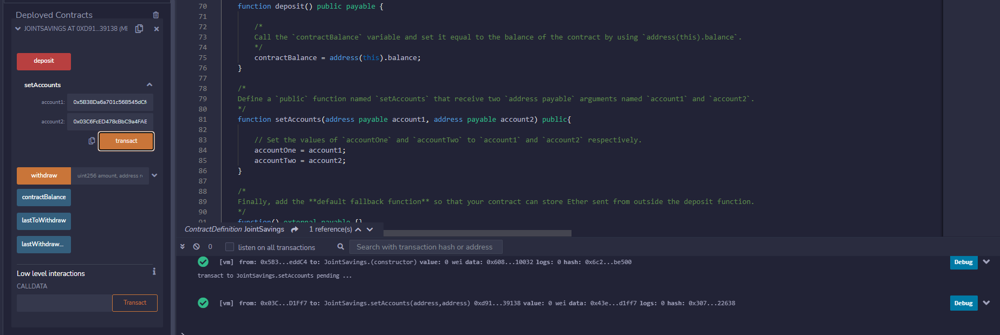
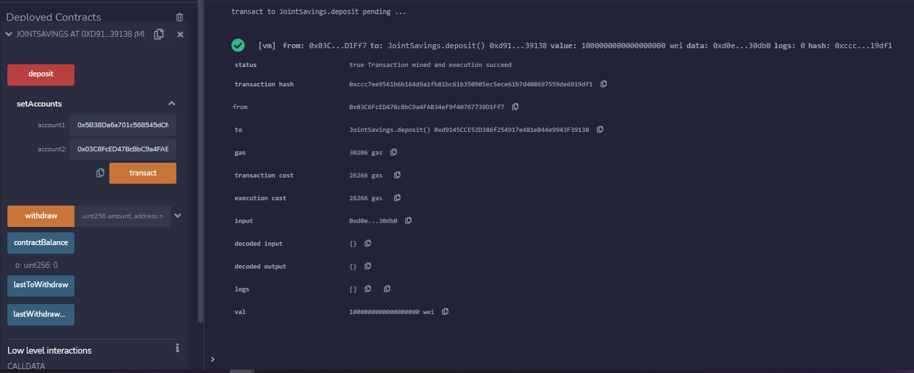
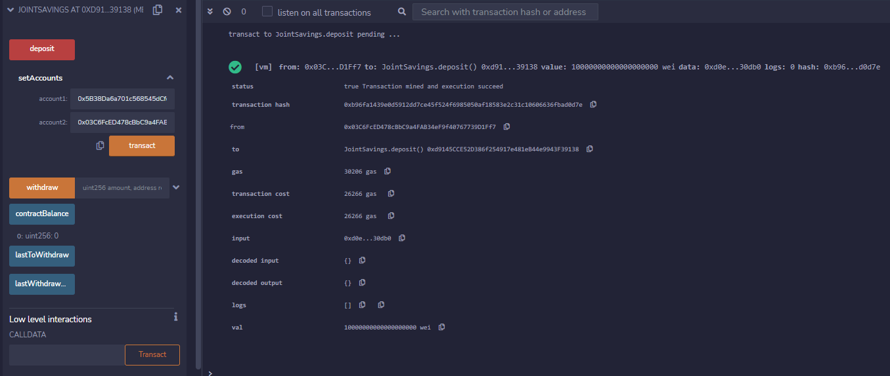
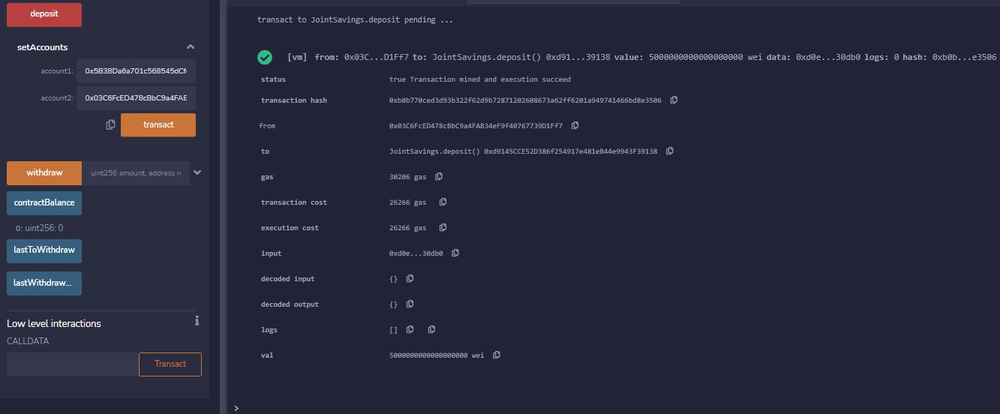
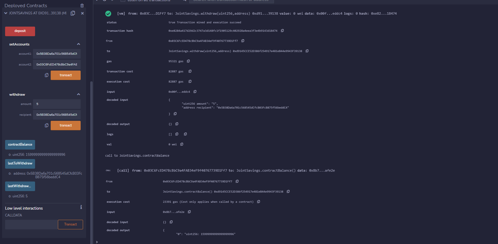
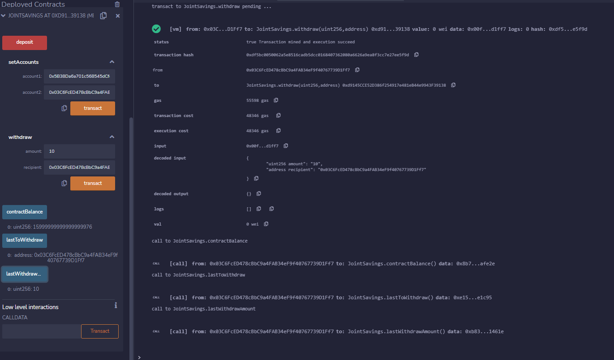

# Joint Savings - Solidity

## Compile and Deploy 
 
  ### Set Accounts 
  
## Deposit
  
  ### Deposit 1 Eth as Wei 
  
  ### Deposit 10 Eth as Wei 
  
  ### Deposit 5 Eth 
  
## Withdraw and Check Balance
  
  ### Withdraw 5 Eth 
  
  ### Withdraw 10 Eth 
